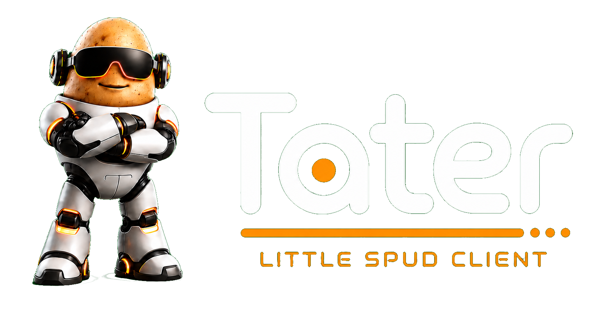

<div align="center">
  <a href="https://taterassistant.com">
    
  </a>
</div>
<h3 align="center">
  <a href="https://taterassistant.com">taterassistant.com</a>
</h3>

# Little Spud iOS

This is the native iOS app for Little Spud. It uses SwiftUI for pairing, chat, QR scanning, reply haptics, device notifications, and the same SpudLink API used by the browser and macOS Little Spud apps.

Device notifications use Firebase Cloud Messaging and Apple Push Notification service to wake the app with a generic Little Spud alert. The real notification content stays in the paired Tater instance and is fetched by the app or notification service extension when possible.

## Build

```sh
scripts/build_app.sh
```

By default this builds for the iOS Simulator with code signing disabled. To build for a signed device target, set the destination and signing options before running the script:

```sh
LITTLE_SPUD_IOS_DESTINATION='generic/platform=iOS' \
LITTLE_SPUD_IOS_CODE_SIGNING_ALLOWED=YES \
LITTLE_SPUD_IOS_CONFIGURATION=Release \
scripts/build_app.sh
```

## Native Features

- SpudLink pairing by QR payload or manual code.
- Tater chat over `/api/spudlink/v1/tater/chat`.
- History sync and queued Little Spud notification polling.
- Device notifications through Firebase/APNs with Tater-side content resolution.
- Reply reveal ticks and completion haptics.
