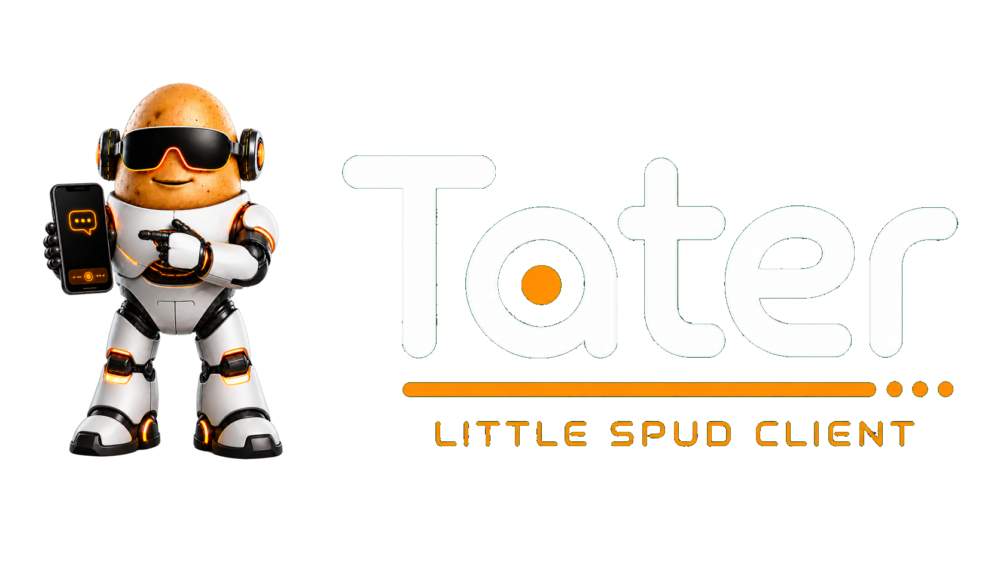

<div align="center">
  <a href="https://taterassistant.com">
    
  </a>
</div>
<p align="center">
  <a href="https://taterassistant.com">
    
  </a>
  <a href="https://discord.gg/w52namKyXT">
    
  </a>
</p>

# Little Spud

Little Spud is the native iOS and Android companion app for a user-controlled, self-hosted [Tater](https://taterassistant.com) instance. Both apps use the same SpudLink API for secure pairing, chat, voice, home controls, Music Core, and device notifications.

Device notifications use Firebase Cloud Messaging and Apple Push Notification service to wake the app with a generic Little Spud alert. The real notification content stays in the paired Tater instance and is fetched by the app or notification service extension when possible.

## Get Little Spud

<p align="center">
  <a href="https://apps.apple.com/app/little-spud/id6781400718">
    
  </a>
  <a href="https://play.google.com/store/apps/details?id=com.tatertotterson.littlespud.android">
    
  </a>
</p>

## Features

- SpudLink pairing by QR code or manual connection details, plus an on-device demo mode.
- A Tater-styled navigation drawer for notifications, chat, Home controls, and Music Core.
- Streaming chat, synchronized history, image attachments, text-to-speech, and live microphone input.
- A dedicated notification inbox with titles, timestamps, snapshots, urgent-alert treatment, and full-screen video playback.
- Provider-neutral room controls for lights, fans, switches, plugs, covers, garage doors, locks, thermostats, cameras, and sensors.
- Automatic, Fahrenheit, and Celsius temperature display preferences shared across the Home experience.
- Music Core browsing, search, playlists, album-art caching, synchronized playback targets and volume, and playback directly on the phone.
- Background notification wake-ups that fetch private alert content directly from the paired Tater instance.

## Build

### iOS

```sh
scripts/build_app.sh
```

By default this builds for the iOS Simulator with code signing disabled. To build for a signed device target, set the destination and signing options before running the script:

```sh
LITTLE_SPUD_IOS_DESTINATION='generic/platform=iOS' \
LITTLE_SPUD_IOS_CODE_SIGNING_ALLOWED=YES \
LITTLE_SPUD_IOS_CONFIGURATION=Release \
scripts/build_app.sh
```

### Android

With JDK 17 and Android SDK Platform 37 installed:

```sh
scripts/build_android.sh
```

The debug APK is written to `android/app/build/outputs/apk/debug/app-debug.apk`. See [`android/README.md`](android/README.md) for Android Studio, release, Firebase, and security setup.

## GitHub Releases

The `Release builds` GitHub Actions workflow runs when a GitHub Release is published. It builds Android and iOS in parallel, verifies the outputs, and attaches these assets to the release:

- Android release APK and AAB, plus SHA-256 checksums.
- Unsigned iOS Simulator app ZIP, plus a SHA-256 checksum.

The workflow can also be run manually from the Actions tab. Manual runs store both builds as Actions artifacts but do not modify a GitHub Release.

Firebase client configuration and Android signing are optional CI secrets. Without them, the workflow still builds, but push is disabled and the Android release is unsigned. Configure these repository secrets for production Android releases:

- `ANDROID_GOOGLE_SERVICES_JSON_BASE64`
- `ANDROID_RELEASE_KEYSTORE_BASE64`
- `ANDROID_RELEASE_STORE_PASSWORD`
- `ANDROID_RELEASE_KEY_ALIAS`
- `ANDROID_RELEASE_KEY_PASSWORD`
- `IOS_GOOGLE_SERVICE_INFO_PLIST_BASE64` for Firebase in the iOS Simulator artifact

Create the Base64 secrets as single-line values, for example: `base64 < google-services.json | tr -d '\n'`. The iOS asset is intended for Simulator testing; signed iPhone/App Store distribution remains an Apple code-signing workflow.
